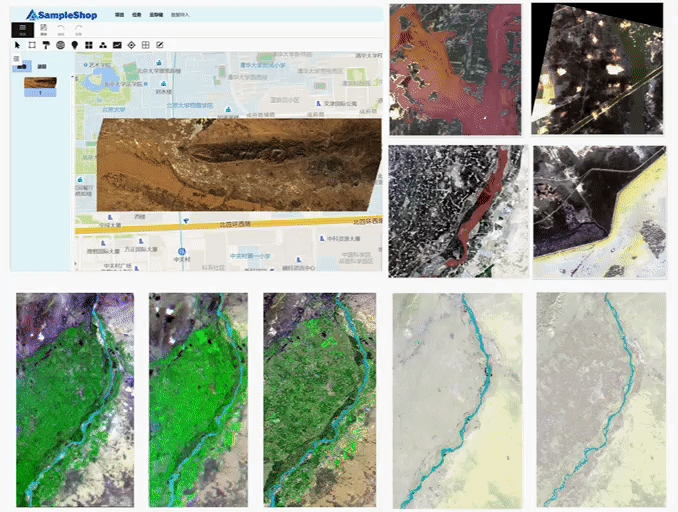
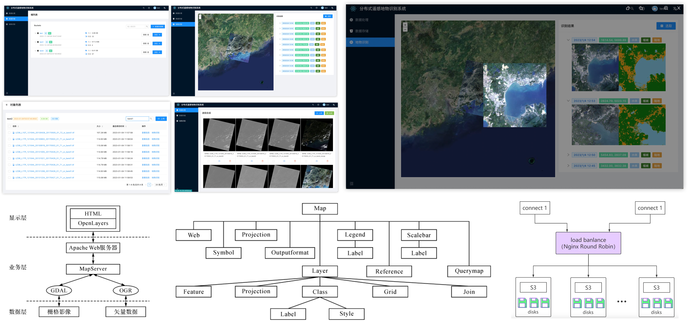
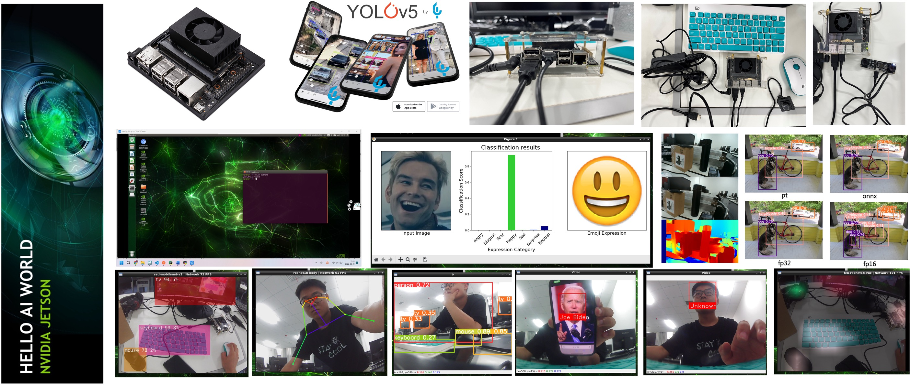

# ⚙️ Projects

2023.03-2023.06

**Multi-source Remote Sensing Interactive Intelligent Annotation System** 

- Content: This project focuses on developing an interactive intelligent annotation system for remote sensing images, particularly for river channels, based on the open-source CVAT annotation tool. The system supports multi-source and multi-band data, enhancing annotation efficiency and accuracy. My role centers on the frontend development of interactive point-based annotation techniques, allowing users to annotate images with simple clicks. We've also deployed various deep learning segmentation models on the backend for frontend use. The project is supported by the National Natural Science Foundation of China.

- Tech Stack: React, PostgreSQL, Redis, MapServer, Django, OpenLayers, GDAL

2022.10-2023.02

**Distributed Remote Sensing Land Use and Land Cover Classification System** 

- Content: This project presents the design and implementation of a distributed remote sensing Land Use and Land Cover (LULC) classification system. It covers the storage and management of remote sensing data, the construction of query indexes, the design of classification algorithms, and the development of a user-friendly interface. The system utilizes GDAL for data preprocessing, MinIO for distributed storage, MapServer for web map services, and FastAPI for the backend, enabling efficient recognition of building, vegetation, and water bodies through normalized difference indices (NDVI, NDWI, NDBI) from Landsat-8 OLI imagery.

- Tech Stack: GDAL, EarthPy, Arcgis (ArcPy), MinIO, MapServer, OpenLayers, FastAPI, Vite+React+Ant

2022.06-2022.08

**Jetson Xavier NX: Edge AI Development Odyssey** 

- Content: This project aims to conduct a series of experiments and deploy diverse deep learning models on the Nvidia Jetson Xavier NX, an edge computing device, from scratch. Six tasks including face/expression/gait/age and gender recognition, image style transfer, and stereo depth estimation, were included. Additionally, I deployed YOLOv5, trained on self-collected data and accelerated with TensorRT's FP32, FP16, and INT8 on the development board. Results showed FP32 could boost FPS from 17.67 to 40.34 with almost no accuracy loss.

- Tech Stack: Nvidia Jetson Xavier NX, PyTorch, OpenCV, Face Recognition, TensorRT, Docker, YOLOv5 

