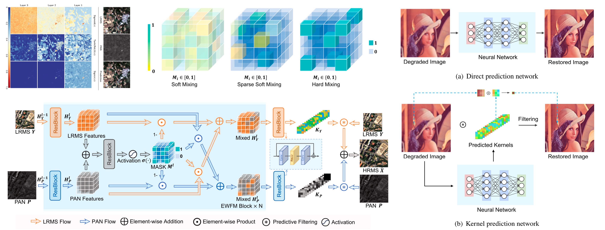
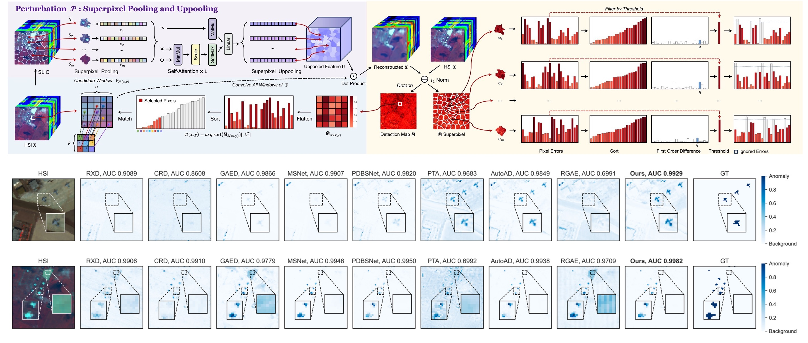
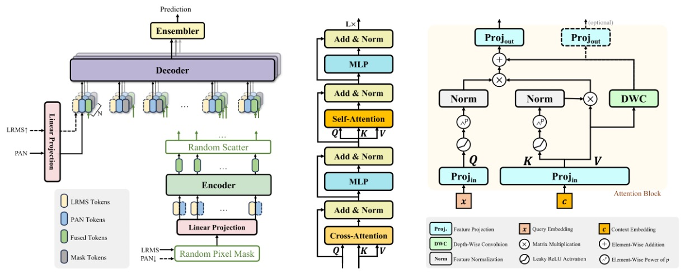
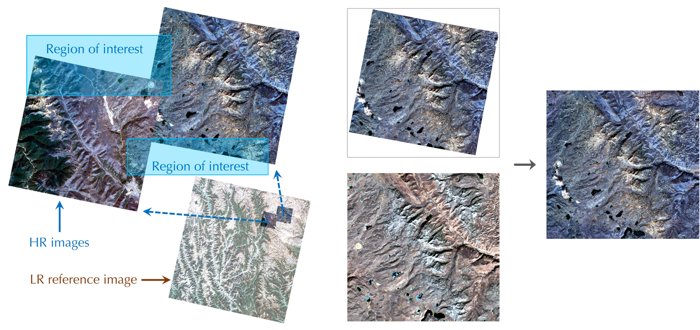
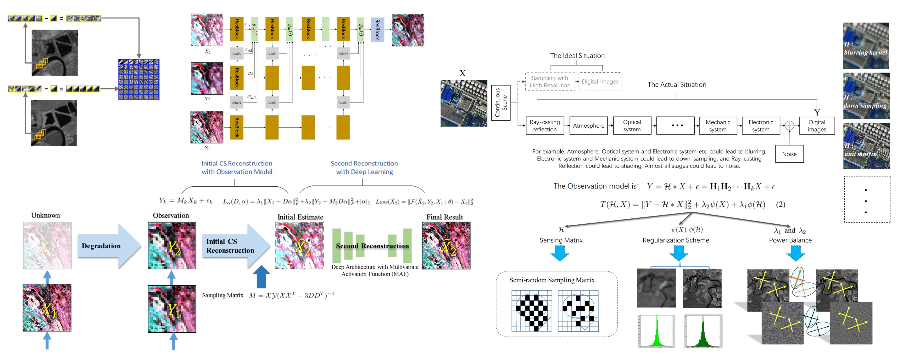
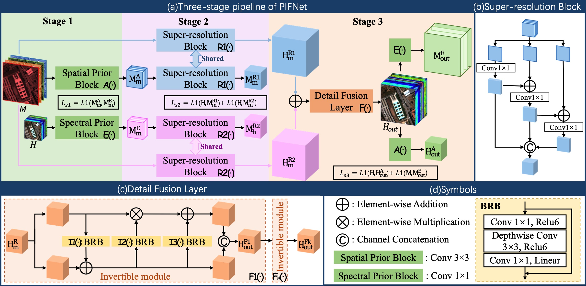
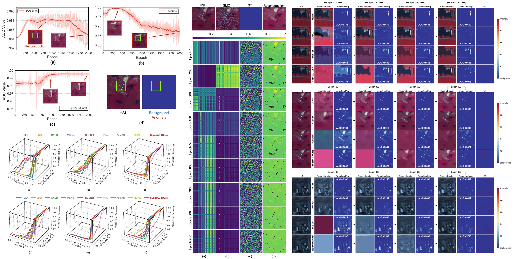
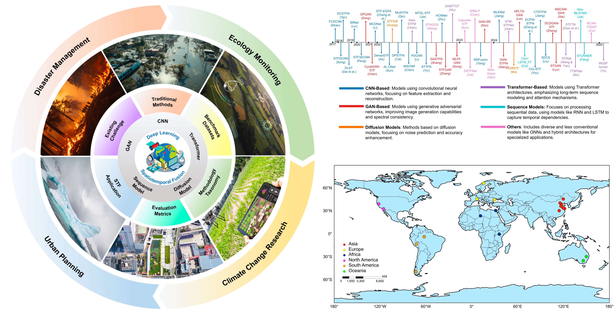
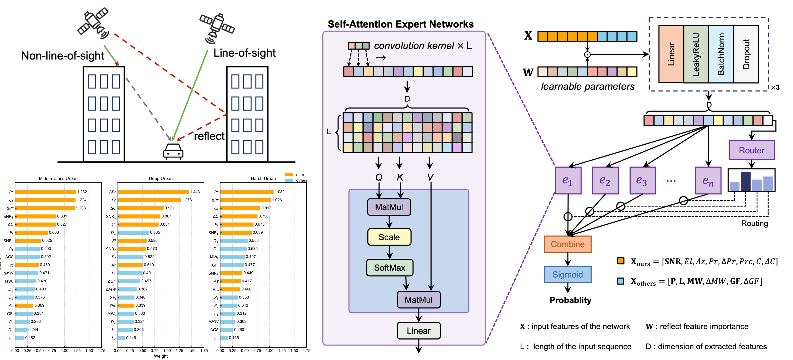

# 📝 Publications

## Acceptance

ISPRS J P&RS 2025

**Pansharpening via Predictive Filtering with Element-wise Feature Mixing** 
***Yongchuan Cui***, Peng Liu†, Yan Ma, Lajiao Chen, Mengzhen Xu, Xingyan Guo 
*[ISPRS Journal of Photogrammetry and Remote Sensing](https://www.sciencedirect.com/journal/isprs-journal-of-photogrammetry-and-remote-sensing) (IF 10.6)* 
📌 Image Fusion 📌 Pansharpening 📌 Low-level Vision  
[📖 Paper](https://www.sciencedirect.com/science/article/abs/pii/S0924271624004064)
[🗒 BibTex](https://yc-cui.github.io/files/ISPRS-PreMix.bib)
[💾 PDF](https://yc-cui.github.io/files/ISPRS-PreMix.pdf)
[💻 Code](https://github.com/yc-cui/PreMix)

IGARSS 2025

**Rethinking Identity Mapping in Self-Supervised Hyperspectral Anomaly Detection: A Unified Perspective on Network Optimization** 
***Yongchuan Cui***, Jinhe Zhang, Peng Liu†, Yan Ma, Yi Zeng 
*[The 45th IEEE International Geoscience and Remote Sensing Symposium, 2025](https://2025.ieeeigarss.org/)* 
📌 Hyperspectral Anomaly Detection 📌 Self-supervised Learning 
[💾 PDF](https://yc-cui.github.io/files/IGARSS-Super-AD.pdf)
[💻 Code](https://github.com/yc-cui/Super-AD)

IEEE TGRS 2024

**Pixel-wise Ensembled Masked Autoencoder for Multispectral Pansharpening** 
***Yongchuan Cui***, Peng Liu†, Yan Ma, Lajiao Chen, Mengzhen Xu, Xingyan Guo  
*[IEEE Transactions on Geoscience and Remote Sensing](https://ieeexplore.ieee.org/xpl/RecentIssue.jsp?punumber=36) (IF 7.5)* 
📌 Image Fusion 📌 Pansharpening 📌 Generalization  
[📖 Paper](https://ieeexplore.ieee.org/document/10649657)
[🗒 BibTex](https://yc-cui.github.io/files/IEEE-TGRS-PEMAE.bib)
[💾 PDF](https://yc-cui.github.io/files/IEEE-TGRS-PEMAE.pdf)
[💻 Code](https://github.com/yc-cui/PEMAE)

IEEE GRSL 2024

**Reconstruction of Large-Scale Missing Data in Remote Sensing Images Using Extend-GAN** 
***Yongchuan Cui***, Peng Liu†, Bingze Song, Lingjun Zhao, Yan Ma, Lajiao Chen  
*[IEEE Geoscience and Remote Sensing Letters](https://ieeexplore.ieee.org/xpl/RecentIssue.jsp?punumber=8859) (IF 4.0)* 
📌 Generative Adversarial Networks 📌 Image Restoration  
[📖 Paper](https://ieeexplore.ieee.org/document/10413911)
[🗒 BibTex](https://yc-cui.github.io/files/IEEE-GRSL-Extend-GAN.bib)
[💾 PDF](https://yc-cui.github.io/files/IEEE-GRSL-Extend-GAN.pdf)
[💻 Code](https://github.com/yc-cui/Extend-GAN)

IEEE J-STARS 2024

**Semiblind Compressed Sensing: A Bidirectional-Driven Method for Spatiotemporal Fusion of Remote Sensing Images** 
Peng Liu, Lizhe Wang†, Jia Chen, ***Yongchuan Cui*** 
*[IEEE Journal of Selected Topics in Applied Earth Observations and Remote Sensing](https://ieeexplore.ieee.org/xpl/RecentIssue.jsp?punumber=4609443) (IF 4.7)* 
📌 Spatiotemporal Fusion 📌 Intelligent Evaluation Technique 📌 AI4Science 
[📖 Paper](https://ieeexplore.ieee.org/abstract/document/10696963)
[🗒 BibTex](https://yc-cui.github.io/files/IEEE-JSTARS-SDCS.bib)
[💾 PDF](https://yc-cui.github.io/files/IEEE-JSTARS-SDCS.pdf)
[💻 Code](https://github.com/yc-cui/SDCS/)

IGARSS 2025

**Prior-based Three-stage Unsupervised Invertible Neural Network for Hyperspectral and Multispectral Image Fusion** 
Mengnan Jin, Wenjuan Zhang†, ***Yongchuan Cui***, Jie Pan, Dailiang Peng 
*[The 45th IEEE International Geoscience and Remote Sensing Symposium, 2025](https://2025.ieeeigarss.org/)* 
📌 Image Fusion 📌 Unsupervised Learning 📌 Hyperspectral Image Processing 
[💾 PDF](https://yc-cui.github.io/files/IGARSS-PIFNet.pdf)

†: Corresponding author.

## Under Review

Under Review

**Overcoming the Identity Mapping Problem in Self-Supervised Hyperspectral Anomaly Detection** 
***Yongchuan Cui***, Jinhe Zhang, Peng Liu†, Yan Ma, Yi Zeng 
Under Review in *[IEEE Transactions on Geoscience and Remote Sensing](https://ieeexplore.ieee.org/xpl/RecentIssue.jsp?punumber=36) (IF 7.5)* 
📌 Self-Supervised Learning 📌 Hyperspectral Anomaly Detection 📌 Identity Mapping  
[💻 Repo](https://github.com/yc-cui/Super-AD)
[🔊 arXiv](https://arxiv.org/abs/2504.04115)

Under Review

**A Decade of Deep Learning for Remote Sensing Spatiotemporal Fusion: Advances, Challenges, and Opportunities** 
Enzhe Sun, ***Yongchuan Cui***, Peng Liu†, Jining Yan† 
Under Review in *[Information-Fusion](https://www.sciencedirect.com/journal/information-fusion) (IF 14.8)* 
📌 Spatiotemporal Fusion 📌 Model Survey  
[💻 Repo](https://github.com/yc-cui/Deep-Learning-Spatiotemporal-Fusion-Survey)
[🔊 arXiv](https://arxiv.org/abs/2504.00901)

Under Review

**Enhancing GNSS Positioning in Urban Environments: A Transformer-Based NLOS Detection and Adaptive Weighting Approach** 
Weiwei Zhai, ***Yongchuan Cui***, Liang Wang†, Ningbo Wang, Zishen Li, Peng Liu, Hang Zhong 
Under Review in *[IEEE Transactions on Instrumentation and Measurement](https://ieeexplore.ieee.org/xpl/RecentIssue.jsp?punumber=19) (IF 5.6)* 
📌 Signal Classification 📌 Mixture-of-experts 📌 Transformer  

†: Corresponding author.

